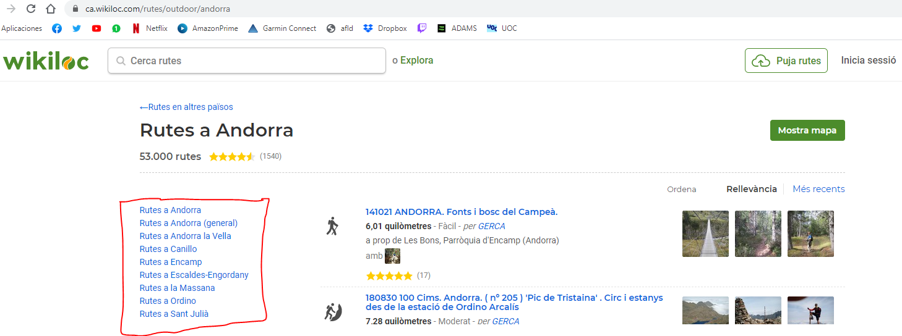

# Pràctica 1: Web Scraping

Aquesta pràctica s'ha realitzat en el context de l'assignatura *Tipologia i cicle de vida de les dades* que pertany al Màster en Ciència de Dades de la Universitat Oberta de Catalunya. En aquesta, s'apliquen tècniques de web scraping mitjançant el llenguatge de programació Python per tal d'extraure dades de la web https://ca.wikiloc.com/ i generar un dataset.

## Instalació
Per a poder executar el programa, s'ha de tenir instal·lat Python3 i executar les comandes següents.

```python
pip3 install requests
pip3 install BeautifulSoup4
pip3 install lxml
pip3 install protego
```

## Ús

```python
#Per a executar el programa s'ha d'introduïr la instrucció següent:
python main.py {activitat} {pais} {regio1} {regio2}

```

Tots els arguments són obligatoris, tot i que es pot filtrar per totes les activitats, tots els països i totes les regions introduint *-1*. Si s'introdueix una *regio2* concreta, s'ha d'introduir una *regio1* i un *país* en concret. De la mateixa manera si s'introdueix una *regio1* concreta, obligatòriament s'ha d'introduir un *país* concret.

Arguments que es poden introduir:

* activitat
    - "outdoor" / "-1": equival a totes les activitats
    - "btt": Bicicleta de muntanya
    - "senderisme": Senderisme
    - "bicicleta-de-carretera": Bicicleta de carretera
    - "correr": Córrer
    -  "cursa-de-muntanya": Cursa de muntanya / Córrer per la muntanya
    -  "alpinisme": Alpinisme
    -  "cicloturisme": Cicloturisme
    -  "a-peu": Passeig
    -  "moto": Moto de carretera
    -  "esqui-de-muntanya": Esquí de muntanya
    -  "moto-trail": Moto trail
    -  "quad": Quad
    -  "kaiac": Caiac / Canoa
    -  "veler": Veler
    -  "raquetes-de-neu": Raquetes de Neu
    -  "esqui-de-fons": Esquí de fons
    -  "esqui": Esquí Alpí
    -  "avio": Avio
    -  "a-cavall": Passeig a cavall
    -  "trineu-de-gossos-mushing": Trineu de gossos
    -  "escalada": Escalada
    -  "patins-en-linia": Patinatge en línia
    -  "patins": patins
    -  "tren": tren
    -  "descens-de-barrancs": Barranquisme
    -  "submarinisme": Submarinisme
    -  "espeologia": Espeologia
    -  "ala-delta": Ala delta
    -  "globus": Globus aerostàtic
    -  "snowboard": Snowboard
    -  "escalada-en-gel" Escalada en gel
    -  "moto-de-neu" Moto de neu
    -  "sender-accessible": Mobilitat reduïda
    -  "4x4": Tot terreny
    -  "rem": Rem
    -  "cotxe": Cotxe
    -  "kiteboarding": Kitesurf
    -  "kite-skiing": Kite skiing
    -  "parapent": Parapent
    -  "per-invidents": Invidents
    -  "marxa-nordica": Marxa nòrdica
    -  "moto-trial": Moto trial
    -  "moto-enduro": Moto enduro
    -  "via-ferrada": Via ferrada
    -  "natacio": Natació
    -  "orientacio": Orientació
    -  "multiesport": Multiesport
    -  "stand-up-paddle-surfing": Paddle surf
    -  "correr-descalc": Correr descalç
    -  "canicross": Canicross
    -  "roller-skiing": Rollerski
    -  "longboard": Longboard / monopatí
    -  "monocicle-de-muntanya": Monocicle de muntanya
    -  "golf": Golf
    -  "autocaravana": Autocaravana
    -  "aerolliscador": Aerolliscador
    -  "segway": Segway
    -  "a-camell": Camell
    -  "freeride": Freeride
    -  "vehicle-aeri-no-tripulat-drone": Drone
    -  "llanxa-motora": Vaixell motor
    -  "observacio-daus": Observació d'aus
    -  "bicicleta-remolc-trailer-bike": Bicicleta amb remolc
    -  "moto-daigua": Moto d'aigua
    -  "handbike": bicicleta de mà
    -  "rafting": Ràfting
    -  "descens-btt": Descens BTT
    -  "bicicleta-electrica": eBike
    -  "salt-base": Salt BASE
    -  "joelette": Joëlette
    -  "amb-cotxet": Cotxet de bebè
    -  "splitboard": Splitboard
    -  "gravel-bike": Bicicleta gravel
*  pais: No es definiran totes les opcions dels països perquè n'hi ha molts s'hi ha d'introduir el nom del país en minúscules i si té més d'una paraula, s'ha de separar per guions. Es pot comprovar els països que hi ha a l'adreça: https://ca.wikiloc.com/rutes. Si es vol comprovar si s'ha introduït correctament el nom del país, es pot accedir a les rutes d'aquest país des d'un navegador i l'estructura que segueix és la següent: `https://ca.wikiloc.com/rutes/outdoor/{nomPais}`.
* regio1: Igual que succeeix amb els països, no es poden introduir totes les regions1, per a introduïr la regio1 si no la coneixem, podem navegar a `https://ca.wikiloc.com/rutes/outdoor/{nomPais}` i es poden visualitzar a la dreta (com podem comprovar en la imatge) les diferents regions. Si accedim a una d'elles podem visualitzar el nom de la regio en la url. Seria: `https://ca.wikiloc.com/rutes/outdoor/{nomPais}/{regio1}`. Per a escollir tots els països, s'ha d'introduïr *-1*.

<p align="center">

</p>

* regio2: Seria exactament igual que la regio1 però en el següent nivell de profunditat, per tant:  `https://ca.wikiloc.com/rutes/outdoor/{nomPais}/{regio1}/{regio2}`.
## Membres de l'equip

La pràctica s'ha realitzat per **Xavier Martin** i **Pol Moya Betriu**.

## Llicència
Todo: Introduïr llicència.


